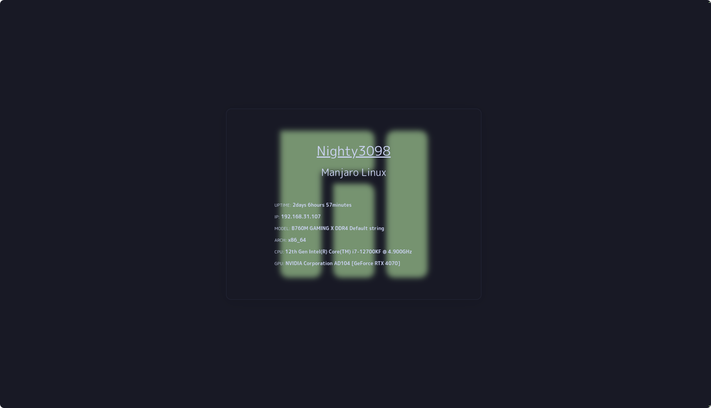
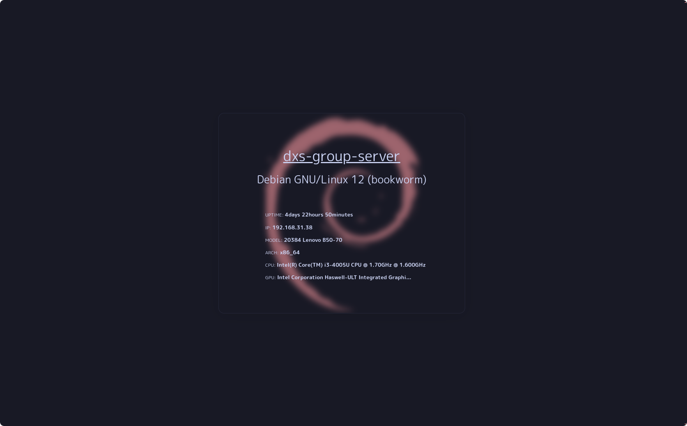

<div align="center">
  
  <br>
  <br>
  <a href="https://t.me/DXS_TechSupport_bot"><kbd> <br>Tech Support<br> </kbd></a>  <a href="https://discord.gg/tnHSEc2cZv"><kbd> <br>Discord server<br> </kbd></a>
  <br><br><br>
  <a href="https://t.me/Night3098" target="blank"></a>
  <a href="https://discord.gg/#9707" target="blank"></a>
  <a href="https://www.reddit.com/user/DEVELOPER0x31/" target="blank"></a>
  <a href="https://signal.me/#eu/XJMqmO9JXZQCwYJIpzjOS741ZnGsLYOQhGqMfpS4lB-8PTSQVmRAbqFIvOrepYiK" target="blank"></a>
  <br>
  <br>
  
  
  
  
  <br>
  <h3>Installing</h3>
  <div align="left">
    
  ```
  git clone https://github.com/SDashS/SDash
  cd SDash
  python3 -m venv SDash
  source SDash/bin/activate
  pip3 install -r requirements.txt
  ```
  </div>
  
  <h3>Run server</h3>
</div>

> [!IMPORTANT]
> This service has been tested on Arch, Debian, Ubuntu, Fedora based systems

```
python3 server.py
```

<div align="center">
  <h3>Usage</h3>
  Use:  <kbd> <br>   Shift   <br> </kbd> + <kbd> <br>   C   <br> </kbd> to open the command palette on PC
  
  <h3>Screenshots</h3>
  
  
  
  
  
  
  

</div>
